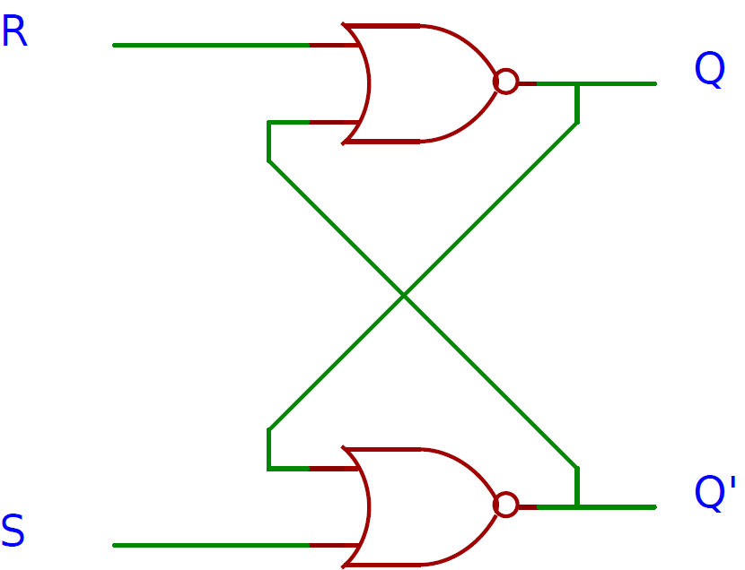

## Lecture 12

### Latches
- RS Latch

	- A cross is used in 2 symmetric NOR switches such that the output of one NOR gate is used as the input of the other NOR gate, and the second input is either R or S.
	- R stands for reset, and S stands for set
If we change the voltages (**in bold**),

| R | S | Q | $\overline{Q}$ |
| --- | --- | --- | --- |
| 1 | 0 | 0 | 1 |
| **0** | 0 $\rightarrow$ 1 | 0 $\rightarrow$ 1 | 1 $\rightarrow$ 0 |
| 0 | **0** | 1 | 0 |
| **1** | 0 | 0 | 1 |
| 1 | **1** | 0 | 0 |
| **0** | **0** | oscillates | oscillates |

- Gated RS Latch
	- A clock is added to disable and enable the latch
	- A clock is square wave generated by a crystal oscillator
| Clock | S | R | Q(t+1) |
| --- | --- | --- | --- |
| 0 | Any | Any | Q(t) |
| 1 | 0 | 0 | Q(t) |
| 1 | 0 | 1 | 0 |
| 1 | 1 | 0 | 1 |
| 1 | 1 | 1 | not used |

This circuit is built by replacing R and S with R' and S' respectively, where R' = clock AND R, and S' = clock AND S.  
If we let R = D and S = ~D, we have

| Clock | D | Q(t+1) |
| --- | --- | --- |
| 0 | Any | Q(t) |
| 1 | 0 | 0 |
| 1 | 1 | 1 |

D is the data input, where when clock = 1, Q = D, but when clock = 0, Q stores the present value of D. Any circuit with this truth table is a gated D latch.

### Flip Flops
- Clock = 0: Qm=0, Q = stored value
- Clock = 1: Q = Qm = D (no longer racks input changes)
- Summary: when clock changes from 0 to 1, the value of D **at that moment** is stored in FF
